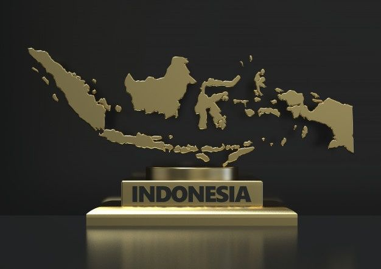

# 🌿 Semesta Budaya

> **Jejak Budaya Indonesia** — Sebuah platform digital interaktif untuk menjelajahi dan melestarikan kekayaan budaya Nusantara.



---

## 📖 Tentang Proyek

**Semesta Budaya** adalah website profil budaya Indonesia yang menampilkan kekayaan tradisi, seni, kuliner, kerajinan, dan keberagaman agama Nusantara melalui desain digital yang modern dan elegan. Proyek ini dibuat sebagai media edukasi dan pelestarian budaya yang menghubungkan tradisi dengan generasi masa kini.

---

## ✨ Fitur Utama

- **Intro Animasi Split-Screen** — Layar pembuka elegan dengan efek split panel yang mulus
- **Navbar Mengambang** — Navbar *fixed* yang bertransisi menjadi *glassmorphism* saat scroll
- **Hero Section + Partikel** — Halaman utama dengan efek partikel animasi *canvas*
- **Statistik Budaya** — Counter animasi untuk data suku, bahasa, pulau, dan provinsi Indonesia
- **Peta Budaya Interaktif** — Peta Indonesia dengan 6 titik *hotspot* yang menampilkan informasi budaya tiap wilayah saat di-*hover*
- **Galeri Budaya** — Carousel *Swiper.js* dengan efek *coverflow* untuk ikon budaya Indonesia
- **Culture Showcase** — Panel bergantian yang menampilkan Batik, Kerajinan, Seni Pertunjukan, dan Kuliner khas Nusantara
- **Keberagaman Agama** — Grid enam agama resmi di Indonesia (Islam, Protestan, Katolik, Hindu, Buddha, Konghucu)
- **Footer Informatif** — Footer dengan statistik, tautan sosial media, dan informasi kontak
- **Desain Responsif** — Tampilan optimal di semua ukuran layar (desktop & mobile)

---

## 🛠️ Teknologi yang Digunakan

| Teknologi | Keterangan |
|---|---|
| **HTML5** | Struktur dan semantik halaman |
| **CSS3 (Vanilla)** | Styling, animasi, layout, dan responsivitas |
| **JavaScript (Vanilla)** | Logika interaktif, observer, partikel, dan counter |
| **Swiper.js v11** | Komponen carousel/slider galeri budaya |
| **Google Fonts** | Tipografi: `Playfair Display` (judul) & `Outfit` (teks) |

---

## 📁 Struktur Direktori

```
cwc/
├── index.html          # Halaman utama
├── style.css           # Seluruh gaya CSS
└── img/
    ├── logo/           # Logo website
    ├── hero/           # Foto utama hero section
    ├── map/            # Gambar peta Indonesia
    ├── carousel/       # Foto galeri budaya (Raja Ampat, Borobudur, dll.)
    ├── batik/          # Foto motif batik (Parang, Ombak, Mega Mendung)
    ├── kerajinan/      # Foto kerajinan (Ukiran Jepara, Wayang, Tenun)
    ├── seni/           # Foto seni pertunjukan (Kecak, Lompat Batu, Wayang)
    ├── kuliner/        # Foto kuliner (Pecel, Papeda, Rendang)
    ├── keberagaman/    # Foto tempat ibadah 6 agama
    └── peta/           # Foto detail budaya per wilayah peta
```

---

## 🚀 Cara Menjalankan

Karena proyek ini murni HTML/CSS/JS statis, cukup buka langsung di browser:

```bash
# Clone repositori
git clone https://github.com/rizkanayaraa/Culture-Verse-.git

# Masuk ke direktori
cd Culture-Verse-

# Buka di browser (klik dua kali atau gunakan live server)
open index.html
```

> **Rekomendasi**: Gunakan ekstensi **Live Server** (VS Code) untuk pengalaman terbaik dengan *hot reload*.

---

## 🗺️ Navigasi Website

| Menu | Section | ID |
|---|---|---|
| Beranda | Hero section utama | `#hero-section` |
| Peta | Peta budaya interaktif | `#peta-budaya` |
| Jelajahi Budaya | Galeri foto carousel | `#galeri-budaya` |
| Keberagaman | Grid 6 agama Indonesia | `#keberagaman` |

---

## 👥 Tim Pengembang

| Nama | GitHub |
|---|---|
| Miqdad F.H | [@miqdadfh](https://github.com/FHRRZZZ) |
| Rizka Ranay | [@rizkanayaraa](https://github.com/rizkanayaraa) |

---

## 📄 Lisensi

Proyek ini dibuat untuk keperluan akademik dan edukasi pelestarian budaya Indonesia.

---

<p align="center">
  Dibuat dengan ❤️ untuk Indonesia 🇮🇩
</p>
